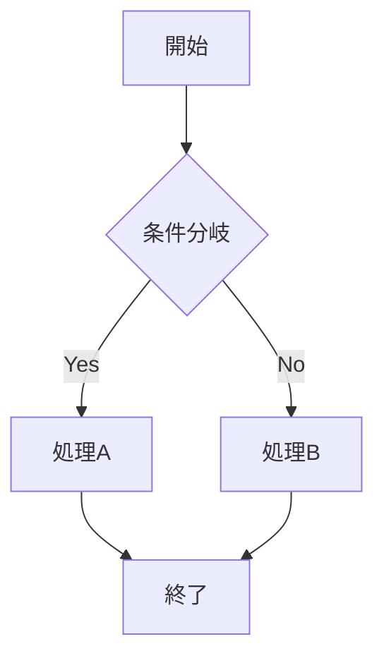
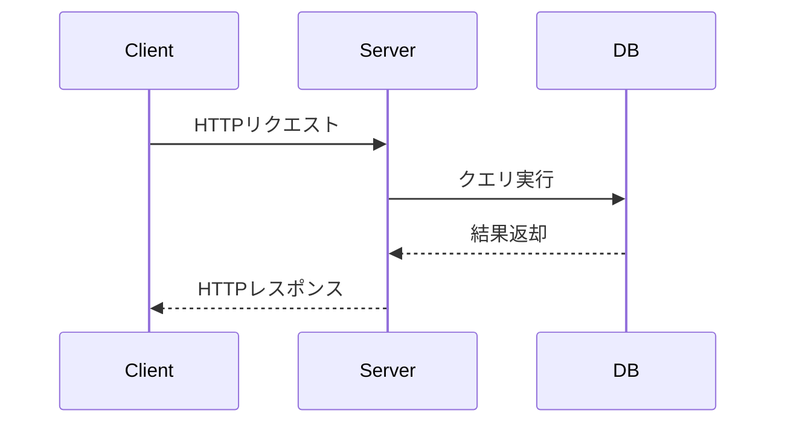
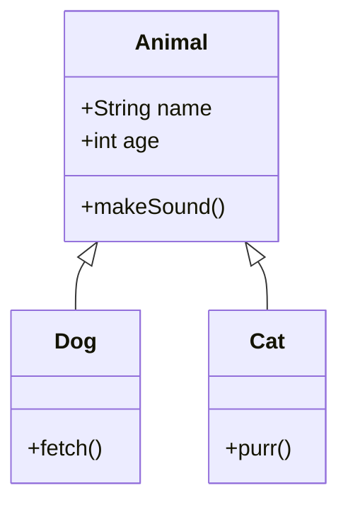
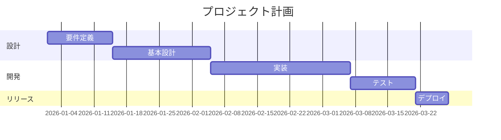
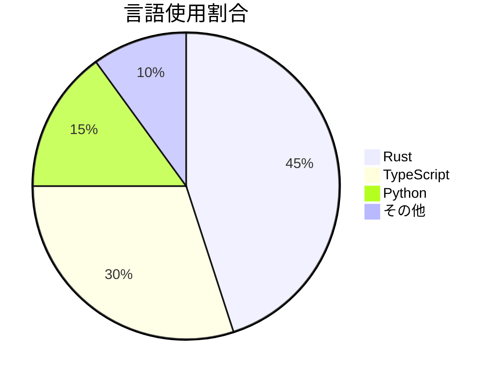
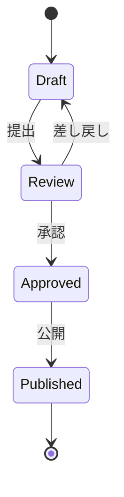

# Mermaid テスト

## フローチャート

```mermaid
flowchart TD
    A[開始] --> B{条件分岐}
    B -->|Yes| C[処理A]
    B -->|No| D[処理B]
    C --> E[終了]
    D --> E
```

## シーケンス図

```mermaid
sequenceDiagram
    participant Client
    participant Server
    participant DB

    Client->>Server: HTTPリクエスト
    Server->>DB: クエリ実行
    DB-->>Server: 結果返却
    Server-->>Client: HTTPレスポンス
```

## クラス図

```mermaid
classDiagram
    class Animal {
        +String name
        +int age
        +makeSound()
    }
    class Dog {
        +fetch()
    }
    class Cat {
        +purr()
    }
    Animal <|-- Dog
    Animal <|-- Cat
```

## ガントチャート

```mermaid
gantt
    title プロジェクト計画
    dateFormat  YYYY-MM-DD
    section 設計
    要件定義       :a1, 2026-01-01, 14d
    基本設計       :a2, after a1, 21d
    section 開発
    実装           :b1, after a2, 30d
    テスト         :b2, after b1, 14d
    section リリース
    デプロイ       :c1, after b2, 7d
```

## 円グラフ

```mermaid
pie title 言語使用割合
    "Rust" : 45
    "TypeScript" : 30
    "Python" : 15
    "その他" : 10
```

## 状態遷移図

```mermaid
stateDiagram-v2
    [*] --> Draft
    Draft --> Review : 提出
    Review --> Approved : 承認
    Review --> Draft : 差し戻し
    Approved --> Published : 公開
    Published --> [*]
```
